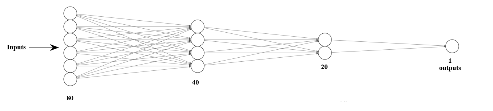
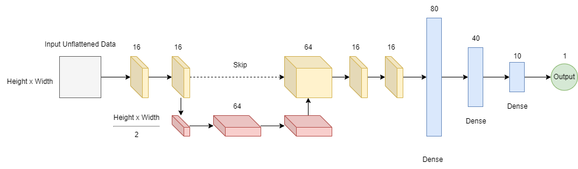

# AmEx-Defaulting-Prediction

This repository shows an experiment comparing a deep nerural network implementing a descending architecture and a unet styled convolutional neural network implementation.

The data this was studied on was the [AmEx-Defaulting-Prediction dataset](https://www.kaggle.com/competitions/amex-default-prediction). The comparison was done only on the basis of a normalized dataset, no data transformations were applied apart from quantifying dates using the ```datatime``` library.

# Descent Network

The descent network was implemented using Tensorflow Dense Layers. The following shows the architecture specifications:

<p align ="center">
  
</p>

The data was processed into the particular format using the ```get_data_descent()``` method and was trained using the ```descent_pipeline()```.

After reaching a plateau, the model would have a mean-squared error of 0.087.

# Unet-Styked Network

The descent network was implemented using Tensorflow Convolutional and Dense Layers. The following shows the architecture specifications:

<p align ="center">
  
</p>

The same data was used as the descent network, however, the 187 data point were cropped to 144 and converted into a 2D-Array which resembles an image. 

The data was processed into the particular format using the ```get_data_unflatten()``` method and was trained using the ```unflatten_pipeline()```.

After reaching a plateau, the model would have a mean-squared error of 0.061.

# Conclusion

The Unet-Styled approach consistently had a lower loss and reached it with less epochs of training. However, in terms of accuracy, both plateaued at 87%.
This means that the Unet_styled approach does extract feautres better on an normalized dataset. 

# Further Scope
By transforming the training data Further, it is possible that the Unet-Styled Aprroach will regress data better than a conventional appraoch. 
